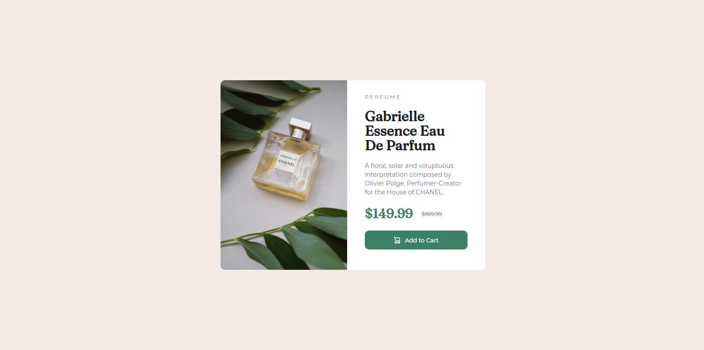
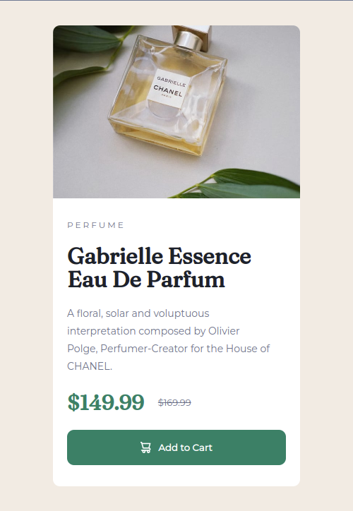

# Frontend Mentor - Product preview card component solution

This is a solution to the [Product preview card component challenge on Frontend Mentor](https://www.frontendmentor.io/challenges/product-preview-card-component-GO7UmttRfa). Frontend Mentor challenges help you improve your coding skills by building realistic projects. 

## Table of contents

- [Overview](#overview)
  - [Screenshot](#screenshot)
  - [Links](#links)
- [My process](#my-process)
  - [Built with](#built-with)
  - [What I learned](#what-i-learned)
  - [Continued development](#continued-development)
  - [Useful resources](#useful-resources)
- [Author](#author)
- [Acknowledgments](#acknowledgments)

## Overview

### Screenshot




### Links

- Solution URL:  (https://github.com/abandonedwaffle/product-preview)
- Live Site URL: (https://abandonedwaffle.github.io/product-preview/)

## My process

### Built with

- HTML5
- CSS custom properties
- Flexbox

### What I learned

One thing I realized during working on this challenge was that I was having issues during arranging the layout. I think I need to relearn the basics of margin and padding for flex items.  

```html
<div class="flex-container">                                                     <!-- Main Flex Container -->
      <div class="img-div">                                                           
        
      </div>
      <div class="text-container">  
        <p class="sub-text-1">PERFUME</p> 

        <h1>Gabrielle Essence Eau De Parfum</h1>

        <p class="para-1">A floral, solar and voluptuous interpretation composed by Olivier Polge, 
          Perfumer-Creator for the House of CHANEL.
        </p>
        <div class="product-prices">

          <p class="current-price">$149.99</p>
          
          <p class="discount-price"><strike>$169.99</strike></p>

        </div>
        <button>
          
          <a href="https://www.youtube.com/watch?v=dQw4w9WgXcQ&ab_channel=RickAstley">Add to Cart</a>
        </button>
    </div>
```
```css
@media only screen and (max-width: 700px){

body{
    overflow-y: hidden;
    overflow-x: hidden;
}
.flex-container{
    display: flex;
    width: 350px;
    flex-direction: column;
    border-radius: 10px;
    background-color: white;
} 
.img-div img{
    content: url(./images/image-product-mobile.jpg);
    border-radius: 10px 10px 0px 0px;
    max-width: 100%;
}
.text-container{
    padding: 10px 20px;
}
button{
    height: 50px;
    margin-bottom: 20px;
}
.para-1{
    line-height: 25px;
    padding-right: 20px;
}
    
}
```
### Continued development

Right now the goal is to master responsive layout. I will keep moving forward doing these challenges.

### Useful resources

- [W3schools](https://www.w3schools.com/) - Has a good HTML/CSS reference.
- [Stack OverFlow](https://stackoverflow.com/) - I wanted to fit an img inside a div, the explanation there was simple.

## Author

- Ritesh Diwan
- Frontend Mentor - [@abandonedwaffle](https://www.frontendmentor.io/profile/abandonedwaffle)

## Acknowledgments

Special thanks to Grace from Front-End Mentor. The feedback on my previous challenge was on point. Learnt about img's having max-width and stuff. Looking forward to the feedback on this one.

